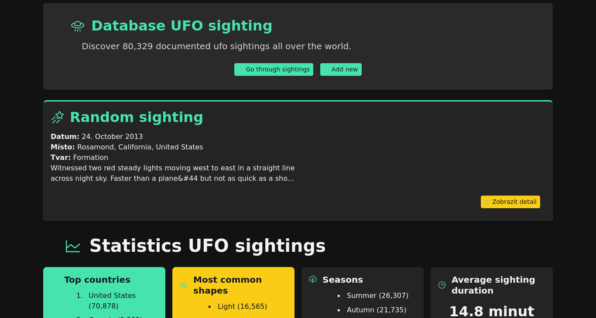
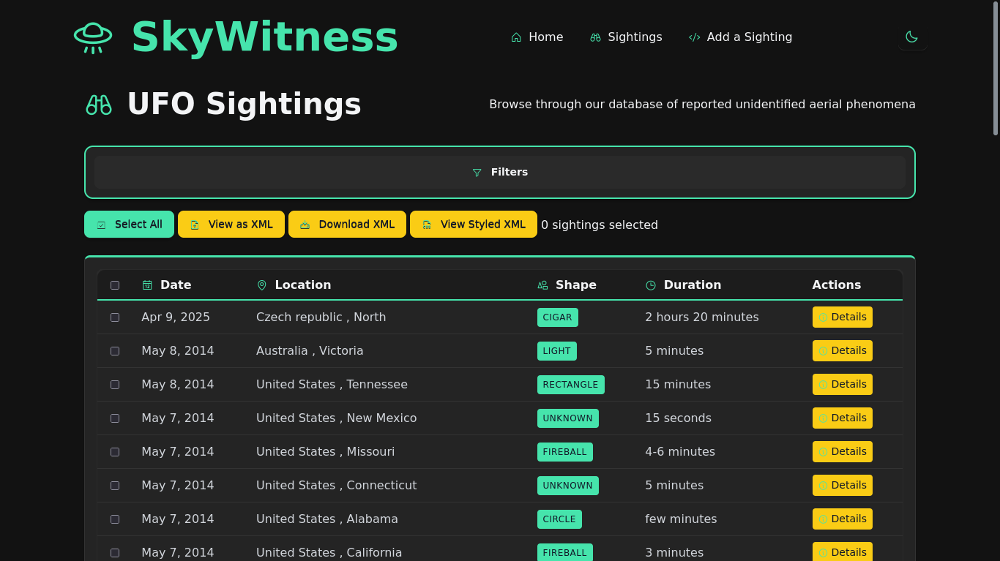
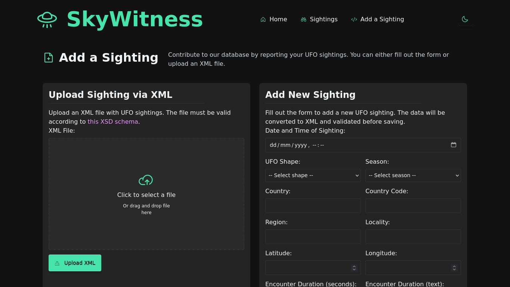
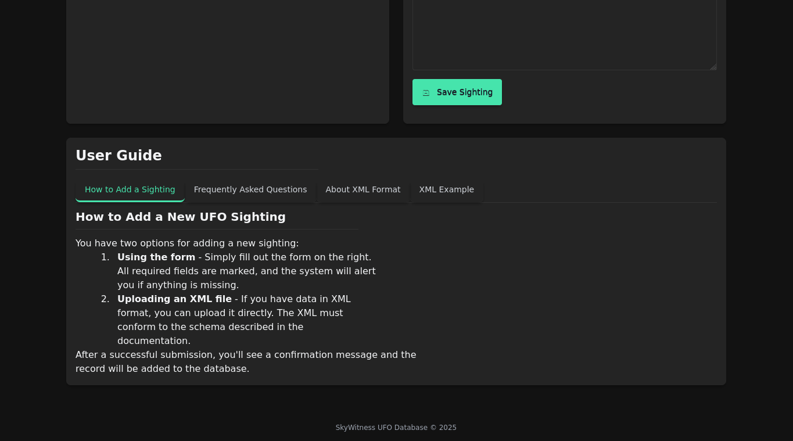
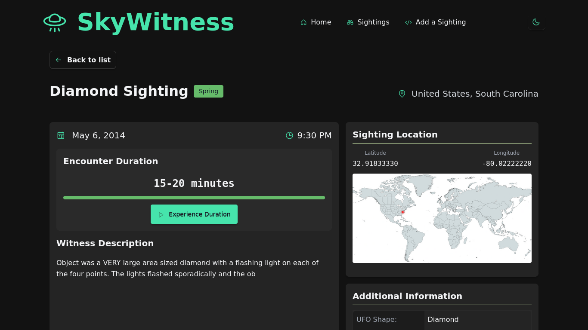
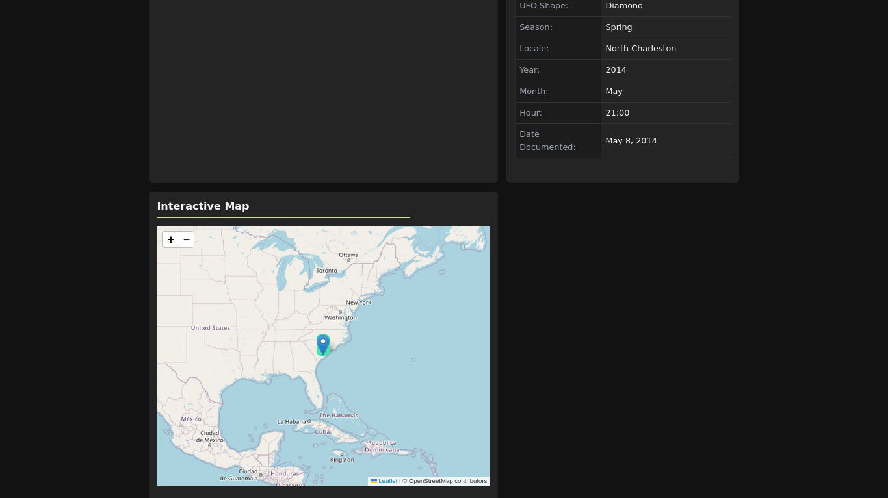

# SkyWitness 👽

**SkyWitness** je webová aplikace pro prohlížení, filtrování a přidávání záznamů UFO pozorování. Pracuje s otevřeným datasetem obsahujícím přes 80 000 záznamů z [tohoto GitHub repozitáře](https://github.com/planetsig/ufo-reports).

---

## 🚀 Jak spustit

1. Naklonuj repozitář:  
```bash
   git clone https://github.com/yourusername/SkyWitness.git
```
3. Spusť Docker Compose:  
```bash
   docker compose up --build
```
5. Aplikace poběží na:  
   `http://localhost:8000`

---

## ✨ Hlavní funkce

- 🛸 **Zobrazení záznamů UFO pozorování** ve formě tabulky s pokročilým filtrováním (datum, lokace, tvar, stát, trvání, atd.)
- 📄 **Export vybraných záznamů do XML** (zobrazit nebo stáhnout, se stylováním i bez)
- 🔍 **Detailní zobrazení jednoho záznamu**:
  - Trvání pozorování s možností **aktivace stopek** pro zažití délky naživo
  - Lokalita (město, stát)
  - **Statická mapa** + **interaktivní mapa (Leaflet.js)** podle GPS souřadnic
  - Kompletní popis události
- ➕ **Přidání vlastního pozorování**:
  - Pomocí HTML formuláře
  - Nebo nahráním XML souboru
  - Oba způsoby prochází **XSD validací**
- 📊 **Domovská stránka** zobrazuje náhodné pozorování a různé statistiky z databáze
- 🌗 **Light/Dark režim** s přepínačem

---

## 🛠️ Použité technologie

- **Vanilla PHP** (bez frameworku)
- **PostgreSQL** (běží v Dockeru)
- **Leaflet.js** (interaktivní mapa)
- **Open Props** (CSS proměnné pro barevné schéma)
- **Phosphor Icons**
- **HTML, CSS, JS, XML, XSD**
- **Docker Compose** pro snadné spuštění backendu

---

## 🖼️ Náhledy

- 
- 
- 
- 
- 
- 


